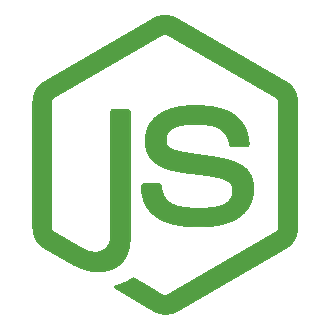

# Cor Cronje

### Senior Full-Stack Engineer | Hardware Hacker | AI-Accelerated Technical Builder

I build production systems across software, computing infrastructure, network infrastructure, IoT, and hardware.

Since 2001, I have delivered business applications, mobile apps, backend platforms, technical infrastructure, embedded electronics, and connected devices used in production. My work spans web and mobile software, backend systems, APIs, network and computing environments, routing, cabling, protocol-driven systems, device integration, and production electronics.

I work where software meets systems and hardware. I use AI agents, coding assistants, and automation to move fast and deliver more, while keeping the standard high: clear thinking, professional execution, and production discipline.

## What You Get With Me

- A builder who understands the full stack in the real sense: software, infrastructure, networks, devices, and hardware.
- Someone who has built production applications and production electronics, not only demos or prototypes.
- Senior-level execution across PHP, Laravel, JavaScript, React, React Native, Node.js, and modern web architecture.
- Strong understanding of computing infrastructure, network infrastructure, connectivity, protocols, and systems that need to perform reliably in the real world.
- Fast, high-leverage delivery using modern AI tooling without compromising engineering quality.

## Selected Work

- Production business applications, APIs, and backend platforms built for real operational use
- Frontend and mobile products delivered with modern JavaScript, React, and React Native stacks
- Computing and network infrastructure spanning servers, routing, connectivity, protocol-level problem solving, and operational reliability
- Embedded and connected systems including IoT, RFID, LoRaWAN, controllers, and production electronics

## Core Stack

	
	
	
	
	
	
	
	

PHP, Laravel, JavaScript, TypeScript, React, Next.js, React Native, Node.js, C#, computing infrastructure, network infrastructure, embedded systems, IoT, RFID, LoRaWAN, electronics, and device-level prototyping.

## Snapshot

Builder, developer, electronics enthusiast, and lifelong tinkerer. I have been coding, breaking, fixing, and building since my school years, and I still enjoy taking ideas from concept to working systems that perform in the real world.
